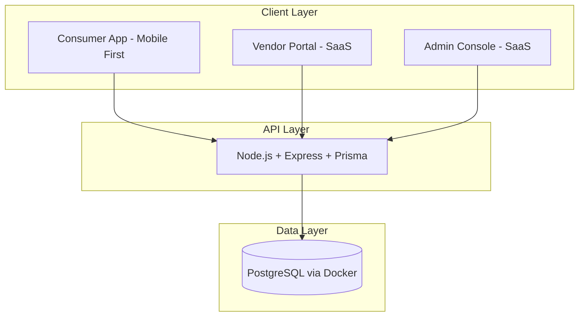

# Gatherly MVP Development Plan

## Project Context

Gatherly is an event planning platform connecting consumers with catering vendors. The MVP includes:

- **Consumer Web App**: Browse vendors, create events, book catering, manage guests
- **Vendor Web Portal**: Register, manage packages, handle bookings
- **Admin Console**: Vendor approval, user management, platform monitoring

**Key constraints for this plan:**

- Docker for PostgreSQL (no cloud DB)
- pnpm as package manager
- Dev-mode auth: signup/login only, no email verification or OTP
- Light theme only
- Consumer: mobile-first, modern app feel, responsive
- Vendor/Admin: SaaS-style UI/UX

---

## Plan & Change Tracking

- **Plans folder:** [docs/plans/](plans/)
- **Change log:** [docs/plan-changes.md](../plan-changes.md) – log what changed after each revision

---

## Architecture Overview



**Recommended structure:** pnpm monorepo with shared backend and three frontend apps.

```
gatherly-v1/
├── apps/
│   ├── consumer/          # Mobile-first consumer app
│   ├── vendor-portal/     # SaaS-style vendor portal
│   └── admin-console/     # SaaS-style admin
├── packages/
│   ├── api/               # Express + Prisma backend
│   └── shared/            # Types, validation schemas
├── docs/
│   ├── plans/             # Saved plans
│   └── plan-changes.md    # Changelog after each plan
├── docker-compose.yml     # PostgreSQL
└── pnpm-workspace.yaml
```

---

## Is This the Best Plan?

**Short answer:** The plan is solid and will work well. For an MVP, there is a simpler alternative worth considering.

### Current Plan (3 apps + Express API)

**Pros:**
- Clear separation: consumer, vendor, admin are independent apps
- Can deploy/scale each app separately
- Express API is a clean REST boundary, easy to document and test
- Aligns with your docs (Consumer Web App, Vendor Portal, Admin Console as distinct products)

**Cons:**
- More boilerplate: 3 Next.js setups, shared auth logic in each, 3 build/deploy pipelines
- Slower to iterate when changing shared UI or auth

### Alternative: Single Next.js App + API Routes

One Next.js app with route groups:

```
app/
├── (consumer)/     # /, /dashboard, /vendors, /bookings...
├── (vendor)/       # /vendor/login, /vendor/dashboard...
├── (admin)/        # /admin/login, /admin/dashboard...
└── api/            # Next.js Route Handlers (replaces Express)
```

**Pros:**
- One codebase, one deploy, one `pnpm dev`
- Shared components, auth, API client
- Faster to ship MVP
- Can split into separate apps later if needed

**Cons:**
- Single bundle (can be mitigated with route-based code splitting)
- API lives in Next.js (fine for MVP; can extract to Express later)

### Recommendation

- **If you want to move fast and validate quickly:** Use the single-app approach.
- **If you expect separate teams, domains, or deployment from day one:** Stick with 3 apps + Express.

The rest of the plan (Docker Postgres, pnpm, Prisma, dev-mode auth, UI guidelines) applies to both approaches.

---

## Phase 1: Foundation

### 1.1 Monorepo and Docker Setup

- **pnpm workspace** with `pnpm-workspace.yaml`:
  - `apps/*` and `packages/*`
- **Docker Compose** for PostgreSQL 14+:
  - Service: `postgres` with healthcheck
  - Volume for data persistence
  - Env: `POSTGRES_USER`, `POSTGRES_PASSWORD`, `POSTGRES_DB`
  - Port: 5432
- `.env.example` with `DATABASE_URL` and other vars

### 1.2 Backend API (`packages/api`)

- **Stack:** Node.js 18+, Express, TypeScript, Prisma
- **Prisma schema** from [techspecs.md](../techspecs.md) (Users, Vendors, Packages, Events, Guests, Bookings, Reviews, Notifications)
- **Dev-mode auth:**
  - `POST /auth/register` – email + password, create user, return JWT (no OTP)
  - `POST /auth/login` – email + password, return JWT
  - `GET /auth/me` – current user
  - JWT middleware, bcrypt for passwords
- **Seed script** for dev data (sample vendors, packages)

### 1.3 Shared Package (`packages/shared`)

- Zod schemas for validation
- Shared TypeScript types
- Constants (roles, statuses, event types)

---

## Phase 2: Consumer App

### 2.1 Tech Stack

- **Next.js 14** (App Router)
- **Tailwind CSS**
- **shadcn/ui** (base components)
- **React Hook Form + Zod**
- **Zustand** for client state

### 2.2 Design System (Light Theme, Mobile-First)

- **Typography:** Clear sans-serif (e.g. Inter or DM Sans)
- **Colors:** Light background, accent for CTAs, subtle borders
- **Layout:** Bottom nav on mobile, touch-friendly targets (min 44px)
- **Components:** Cards, bottom sheets, floating actions, skeletons

### 2.3 Core Pages (P0)

| Page           | Route            | Notes                                   |
| -------------- | ---------------- | --------------------------------------- |
| Landing        | `/`              | Hero, CTA, feature highlights           |
| Register       | `/register`      | Email + password only                   |
| Login          | `/login`         | Email + password                        |
| Dashboard      | `/dashboard`     | Quick actions, upcoming events          |
| Browse Vendors | `/vendors`       | Search, filters, grid/list              |
| Vendor Profile | `/vendor/[id]`   | Tabs: About, Packages, Gallery, Reviews |
| Create Event   | `/events/create` | Multi-step form                         |
| My Bookings    | `/bookings`      | Tabs: Active, Past, Cancelled           |
| Profile        | `/profile`       | Basic info, settings                    |

### 2.4 Consumer UX Patterns

- Bottom navigation: Home, Browse, Create (+), Bookings, Profile
- Sticky CTAs on key flows
- Skeleton loaders
- Pull-to-refresh where relevant
- Responsive: mobile-first, then tablet/desktop

---

## Phase 3: Vendor Portal

### 3.1 Tech Stack

- Same as consumer: Next.js 14, Tailwind, shadcn/ui
- Separate app for clear separation and future scaling

### 3.2 Design System (SaaS-Style)

- **Layout:** Sidebar nav, top bar with user menu
- **Tables:** Sortable, filterable
- **Forms:** Multi-step wizards for registration and package creation
- **Cards:** Metrics, lists, forms

### 3.3 Core Pages (P0)

| Page            | Route           | Notes                             |
| --------------- | --------------- | --------------------------------- |
| Vendor Login    | `/login`        | Email + password                  |
| Vendor Register | `/register`     | Multi-step (business, docs, bank) |
| Pending         | `/pending`      | Application submitted             |
| Dashboard       | `/dashboard`    | Metrics, pending requests         |
| Profile         | `/profile`      | Business info, gallery            |
| Packages        | `/packages`     | List, create, edit                |
| Bookings        | `/bookings`     | Pending, confirmed, completed     |
| Availability    | `/availability` | Calendar                          |

---

## Phase 4: Admin Console

### 4.1 Design

- Same SaaS layout as vendor portal
- Dashboard with platform metrics
- Tables for users, vendors, bookings

### 4.2 Core Pages (P0)

| Page        | Route        | Notes                      |
| ----------- | ------------ | -------------------------- |
| Admin Login | `/login`     | Admin-only route           |
| Dashboard   | `/dashboard` | Metrics, recent activity   |
| Vendors     | `/vendors`   | Pending, approved, actions |
| Users       | `/users`     | List, suspend, ban         |
| Bookings    | `/bookings`  | Oversight                  |

---

## Phase 5: Integration and Polish

- Connect all apps to API
- End-to-end flows: signup → browse → create event → book → vendor accept → payment (dummy)
- Error handling, loading states
- Basic accessibility (keyboard nav, ARIA)

---

## Key Implementation Details

### Auth Simplification (Dev Mode)

- Skip OTP, email verification, password reset emails
- Register: `email`, `password`, `name`, `role` → create user → return JWT
- Login: `email`, `password` → return JWT
- Store JWT in `localStorage` or httpOnly cookie

### Database Schema (Start Small)

Implement first:
- `users` (with `role`: consumer, vendor, admin)
- `vendors` (linked to `users`)
- `packages`, `package_items`
- `events`, `guests`
- `bookings`, `booking_items`
- `reviews`, `notifications`

Defer or simplify: `messages`, `vendor_availability` (can add later).

### UI/UX Guidelines

**Consumer (mobile-first):**
- Bottom nav, large touch targets
- Card-based lists, swipeable carousels
- Floating "+" for create event
- Light, clean palette

**Vendor/Admin (SaaS):**
- Sidebar + top bar
- Data tables with filters
- Metric cards
- Consistent spacing and typography

---

## Suggested Start Order

1. **Docker + pnpm workspace** – project skeleton
2. **Backend API** – Prisma, DB, auth (register/login), health check
3. **Consumer app** – landing, auth, dashboard, vendor browse
4. **Vendor portal** – auth, dashboard, packages
5. **Admin console** – auth, dashboard, vendor approval
6. **Booking flow** – event creation, package selection, booking request
7. **Guest management** – add/edit/import guests
8. **Dummy payment** – simulate payment completion

---

## Files to Create First

| File                  | Purpose                  |
| --------------------- | ------------------------ |
| `pnpm-workspace.yaml` | Workspace config         |
| `docker-compose.yml`  | PostgreSQL service       |
| `packages/api/`       | Express + Prisma backend |
| `packages/shared/`    | Types and schemas        |
| `apps/consumer/`      | Consumer Next.js app     |
| `apps/vendor-portal/` | Vendor Next.js app       |
| `apps/admin-console/` | Admin Next.js app        |
| `.env.example`        | Env template             |

---

## Out of Scope (Per Your Specs)

- Email sending (welcome, OTP, reset)
- SMS/OTP verification
- Dark theme
- Native mobile apps
- Real payment processing
